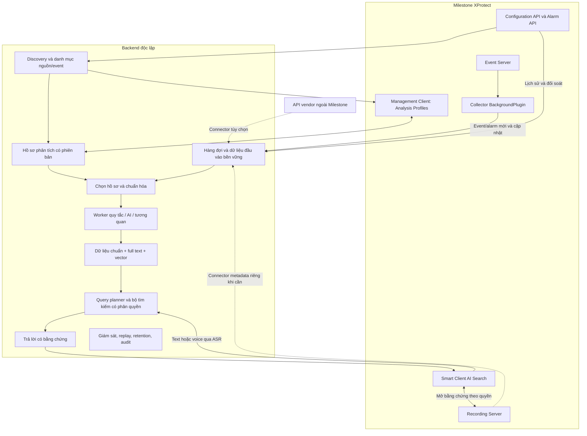

# Kiến trúc V2 — Tìm kiếm Milestone theo hồ sơ phân tích

Ngày: 16-09-2026. Trạng thái: thiết kế đề xuất, chưa phải hệ thống đã triển khai. Đây là thiết kế hiện hành; [khảo sát Event Server](EVENT-SERVER-SEARCH-ARCHITECTURE.md) giữ vai trò bằng chứng kỹ thuật. Chưa chốt model, engine chỉ mục, phần cứng hoặc SLA.

## 1. Mục tiêu và phạm vi

Tìm event/alarm bằng text/voice trong Smart Client, trả bản ghi, timeline, snapshot và tham chiếu video. Khi thêm nguồn AI/hệ tích hợp, ưu tiên bổ sung **hồ sơ phân tích** thay vì sửa collector hoặc huấn luyện lại model. Chỉ áp dụng cách này khi interface và định dạng dữ liệu đã được hỗ trợ.

Ba mức hỗ trợ: (1) nhận/lưu/tìm trường gốc; (2) ánh xạ và trích xuất theo cấu hình; (3) phân tích hình ảnh, tương quan và suy luận có nguồn. Không coi việc nhận alarm là đã hiểu mọi thuộc tính AI. Tìm hồ sơ Incident Manager là connector riêng còn cần xác minh; một cụm alarm không tự trở thành incident chính thức.

## 2. Sơ đồ tổng thể

## 3. Các thành phần và trách nhiệm

| Thành phần | Chức năng | Ranh giới |
|---|---|---|
| Event Server collector | Nhận event/alarm và thay đổi; sao chép payload, queue, checkpoint | Không chạy model hoặc tải clip trong callback |
| Discovery | Đồng bộ event types, alarm messages, nguồn, cấu hình có thể truy cập; thống kê mẫu đã quan sát | Không suy ra schema payload chỉ từ tên event |
| Profile service | Quản lý cấu hình, version, thử mẫu, kích hoạt/rollback | Một model không được tự kích hoạt cấu hình mới |
| Ingestion service | Kiểm tra envelope, lưu bền, chống trùng, retry, cập nhật/xóa | Không sửa bảng SQL Milestone |
| Analysis workers | Parser, mapping, embedding, phân tích media tùy chọn, tương quan | Dữ liệu suy luận tách khỏi dữ liệu gốc |
| Search service | Lọc quyền, structured/full-text/vector, đếm, xếp hạng, truy vấn chuỗi sự kiện | Không cho LLM chạy SQL hoặc thao tác VMS tùy ý |
| Management plugin | Màn hình danh mục, profile editor, sample preview, test/replay, trạng thái | Đề xuất UI trong Management Client; điểm mở rộng cụ thể phải kiểm thử với SDK đích |
| Smart Client plugin | Tab AI Search: text/voice, kết quả, timeline, nguồn và video | Giai đoạn đầu chỉ đọc; SearchAgent bổ sung cho kết quả có video |
| Operations console | Ingest lag, hàng đợi, lỗi, coverage, quota, audit, retention | Không chứa bí mật trong log hoặc prompt |

Collector C# dùng MIP SDK tương thích release đích; backend giao tiếp bằng contract độc lập phiên bản SDK. Lựa chọn runtime/framework cụ thể thuộc bước triển khai, không suy từ phiên bản SQL Server.

## 4. Discovery: lấy danh mục và phát hiện tích hợp mới

Nguồn danh mục:

- `GET /api/rest/v1/alarmMessages`: thông điệp alarm; SDK có `IAlarmClient.GetAlarmMessages()` cho các thông điệp đã nhận. Đây không phải danh mục AI chuẩn.
- Configuration API `/api/rest/v1/eventTypes`: loại event đã định nghĩa, gồm loại có thể chưa phát sinh dữ liệu.
- Configuration API/MIP lấy cấu hình nguồn và rule/alarm definition trong phạm vi version và quyền hỗ trợ.
- Quan sát realtime + lấy detail các bản ghi lịch sử để biết trường thực sự được điền.

Mỗi mục có `site`, ID loại/nguồn, tên hiển thị, first/last seen, trạng thái cấu hình, trạng thái quan sát, field inventory và profile áp dụng. Phân biệt **đã cấu hình**, **đã quan sát**, **đã hiểu**, **đang phân tích**. Message động như “đi muộn 146 phút” không được tự tạo một loại AI mới.

Đồng bộ định kỳ và khi cấu hình thay đổi. Không giả định một thông báo thay đổi luôn chứa toàn bộ cấu hình; nó có thể chỉ kích hoạt refresh. Loại chưa có profile vào nhóm chưa phân loại, lưu giới hạn theo chính sách site và cho phép tìm trường gốc. Không tự tải media hoặc giữ vô hạn dữ liệu từ nguồn mới.

Nguồn: [Alarms API](https://doc.developer.milestonesys.com/mipvmsapi/api/alarms-rest/v1/), [IAlarmClient](https://doc.developer.milestonesys.com/mipsdk/miphelp/interface_video_o_s_1_1_platform_1_1_proxy_1_1_alarm_client_1_1_i_alarm_client.html), [Events and State subscription](https://doc.developer.milestonesys.com/mipsdk/gettingstarted/intro_event_and_state_subscription.html).

## 5. Hồ sơ phân tích — chức năng trung tâm

| Nhóm cấu hình | Nội dung |
|---|---|
| Nhận diện nguồn | Site, event type ID, source ID/group, điều kiện message, connector; ưu tiên ID hơn tên |
| Chọn dữ liệu | Trường header, description, object/vendor payload, snapshot; metadata/clip nếu connector và quyền cho phép |
| Ánh xạ | Đường dẫn JSON/XML đã chuẩn hóa, kiểu dữ liệu, enum, đơn vị, timezone, required/optional |
| Chuẩn hóa nghiệp vụ | Event family/code, tên được nguồn báo cáo, plate, zone/door, số đếm, độ trễ |
| Các bước xử lý | Mapping/parser, LLM extraction, embedding, image/clip analysis, correlation; bật riêng từng bước |
| Ngữ cảnh | Mô tả sự kiện, ca làm việc, camera–cửa–zone, SOP, điều kiện và ý nghĩa trạng thái |
| Đầu ra | JSON schema, trường được index, trường gốc/suy luận, evidence requirements |
| Lưu trữ/quyền | Allowlist trường, raw retention, index retention, cache ảnh, ACL, xóa theo nguồn |
| Hiệu năng | Batch, timeout, retry, giới hạn tốc độ/media, ngân sách model, fallback |

Vòng đời: **Draft → thử mẫu → Validated → Active → Retired**. Mọi thay đổi tạo version bất biến; rollback kích hoạt lại version trước. Chỉ người có quyền quản trị được kích hoạt. Lưu effective time để không giải thích alarm cũ bằng cấu hình mới một cách im lặng.

Một record có một profile chuẩn hóa chính. Nếu nhiều profile khớp: chọn theo priority rõ ràng; nếu cùng mức thì báo conflict, không chạy tùy ý. Các bước enrichment bổ sung phải được khai báo. Một profile có thể tái sử dụng template, nhưng mapping nguồn vẫn cần thử payload thực.

Trình soạn cấu hình hiển thị raw mẫu → field mapping → kết quả chuẩn hóa → truy vấn thử. Test bao gồm thiếu field, kiểu sai, mã lạ và biến thể message. Replay lịch sử tạo version dữ liệu dẫn xuất mới, giữ source ID và không tăng số đếm sự kiện.

Chỉ dùng phép biến đổi khai báo được giới hạn tài nguyên; không cho profile chứa mã thực thi tùy ý. Nội dung payload/SOP là dữ liệu không tin cậy đối với model, không được biến thành lệnh gọi công cụ.

### Ví dụ hồ sơ

| Hồ sơ | Dữ liệu đọc | Xử lý | Khả năng tìm |
|---|---|---|---|
| FaceMe known/unknown | Message, mô tả, camera/time, snapshot nếu có | Mapping, tên được báo cáo, embedding văn bản | Người lạ ở cổng; cảnh báo ghi tên cụ thể |
| Attendance | Message, time, source | Parser tên/số phút, đối chiếu lịch có version | Đi muộn trên 60 phút; thống kê theo ngày |
| ACS door | Event code, door ID, time, state | Map denied/forced/held-open; tương quan cùng cửa | Từ chối thẻ rồi mở cửa trong khoảng thời gian |
| BMS fire | Code, detector, zone, state | Map fire/fault/test/reset theo tài liệu hãng; gắn camera | Báo cháy theo tầng, trạng thái và thời gian |
| i-PRO analytics | Payload alarm và metadata nếu có | Profile riêng theo app/event; không đoán thuộc tính từ tên | Crossline, occupancy, plate… trong phạm vi dữ liệu thật |

Các tên/trường trên là mẫu thiết kế, không khẳng định mọi connector đang cung cấp đủ dữ liệu. ACS “access denied rồi door opened” chỉ tạo nghi vấn; không kết luận ý định cố tình hoặc danh tính nếu thiếu bằng chứng.

## 6. Model làm gì

| Vai trò | Đầu vào → đầu ra | Cách kiểm soát |
|---|---|---|
| Hỗ trợ tạo profile | Mẫu payload + tài liệu → đề xuất mapping | Người quản trị kiểm tra và kích hoạt |
| Trích xuất tùy chọn | Field được chọn → JSON theo schema | Parser trước, LLM khi cần; validation, missing/unknown, provenance |
| Embedding | Nội dung chuẩn hóa → vector | Ghi model/version; không nhúng video hoặc binary vào text |
| ASR | Voice → transcript | Cho sửa tên/biển số/thời gian; dùng chung luồng text |
| Query planner | Câu hỏi + catalog → query plan có schema | Allowlist thao tác; xác minh thời gian, nguồn và quyền |
| Reranker tùy chọn | Câu hỏi + ứng viên hợp lệ → thứ hạng | Không thêm record ngoài tập được phép |
| RAG answer | Bằng chứng + ngữ cảnh → giải thích và citations | Dẫn ID/camera/time; nói rõ thiếu coverage hoặc suy luận |
| VLM tùy chọn | Snapshot/clip → mô tả dẫn xuất | Chỉ chạy theo profile; không thay bằng chứng hoặc xác nhận danh tính |

Không cần huấn luyện một model riêng cho mỗi hệ tích hợp. Bắt đầu bằng model có sẵn, profile và eval; chỉ fine-tune khi lỗi lặp lại có dữ liệu đủ và benchmark cho thấy cần. Chưa chọn model thương mại/open-weight hoặc cấu hình GPU vì chưa biết tải, ngôn ngữ thực tế và ràng buộc triển khai.

## 7. Dữ liệu backend lưu và tránh trùng

Milestone là nguồn chính của alarm/video; backend lưu bản sao chọn lọc phục vụ tìm kiếm cùng kết quả dẫn xuất.

| Kho logic | Nội dung | Chính sách |
|---|---|---|
| Raw inbox | Envelope và payload cần thiết để retry/reprocess | Hạn lưu/quota riêng; dữ liệu nhạy cảm theo allowlist |
| Canonical records | ID gốc, nội dung, thời gian, nguồn, trạng thái, thuộc tính chuẩn | Upsert, phân quyền, retention và tombstone |
| Search indexes | Structured/full-text/vector | Có thể tái tạo từ record và profile |
| Context/profile catalog | Mapping và cấu hình có version | Lưu lịch sử để giải thích kết quả |
| Derived observations | Caption, entity extraction, quan hệ suy luận | Gắn model/profile version và evidence refs |
| Evidence references | Camera/time, snapshot IDs; cache thumbnail tùy chọn | Không sao chép toàn bộ recording |
| Operational ledger | Checkpoint, retry, audit, coverage gap | Theo quota và yêu cầu vận hành |

Khóa record: `site_id + record_kind + source_guid`; local alarm ID và tag là trường phụ. Event và alarm giữ riêng, có liên kết khi có ID/căn cứ; người hỏi phải phân biệt “số alarm” và “số lần xảy ra”. Update trạng thái không sinh embedding mới nếu nội dung tìm không đổi. Cache ảnh hết hạn riêng; snapshot còn không bảo đảm video còn.

Event không lưu trong Milestone nhưng collector nhận được có thể chỉ còn ở backend. Phải xác định rõ chính sách này, không gọi toàn bộ backend là cache có thể phục hồi từ VMS. Xóa và quyền thay đổi cần cập nhật cả raw, derived, index, cache và context có thông tin liên quan.

## 8. Thu nhận và độ bền

BackgroundPlugin nghe event indication (chọn singular hoặc batch), alarm mới/thay đổi và cấu hình đổi. Giữ callback ngắn; worker chuyển sang queue bền, backend upsert rồi xác nhận. Đồng bộ lịch sử qua API có paging/checkpoint và khoảng chồng lấn; đối soát update/xóa định kỳ.

Không cam kết exactly-once: có cửa sổ mất dữ liệu trước khi persist nếu process crash. Event không được VMS lưu không thể backfill từ API. Queue đầy/disk đầy phải báo lỗi và coverage gap, không mất im lặng. Failover cần instance identity, dedup phía backend và kiểm chứng lấy lại checkpoint. Source/data không hỗ trợ replay phải công bố giới hạn.

Collector alarm không nhận toàn bộ metadata streaming. Metadata dùng connector riêng đến Recording Server; dữ liệu vendor ngoài payload dùng connector vendor. Có thể thêm profile mà không viết module chỉ khi các adapter/parser cần thiết đã tồn tại.

## 9. Công cụ quản trị và tìm kiếm

**Management Client — Analysis Profiles:** danh mục nguồn/event, trạng thái discovery; xem mẫu đã che trường không được phép; tạo hồ sơ từ template; chọn field/bài phân tích; test, activate, rollback; mapping zone/camera; cấu hình quyền, retention, quota và connector credentials qua kho bí mật.

**Smart Client — AI Search:** ô text/voice, hiển thị query được hiểu, bộ lọc, bảng kết quả, timeline, preview; mở alarm gốc/video; tìm chuỗi sự kiện; thống kê chính xác; tóm tắt có nguồn; chỉ báo index lag và dữ liệu thiếu. SearchAgentPlugin thêm sau cho kết quả camera/time trong Search workspace; record không có camera vẫn tìm được trong tab riêng.

**Operations:** backlog, ingest/index lag, throughput, profile errors, field drift, retry/dead-letter, lượng dữ liệu chưa phân loại, retention/xóa và quyền. Replay có phạm vi, chạy thử và giới hạn tài nguyên.

Backend xác thực user và áp ACL trước retrieval/reranking/LLM, không tin source IDs do client tự gửi. Quyền alarm và video được kiểm tra riêng; tài khoản ingestion quyền rộng không được dùng làm quyền mặc định của người tìm kiếm. Cơ chế danh tính Smart Client → backend còn phải kiểm chứng trên release đích.

## 10. Luồng thêm hệ tích hợp mới

1. Hệ nguồn được tích hợp và cấu hình gửi dữ liệu vào Milestone.
2. Discovery thấy event definition/message mới hoặc collector quan sát payload mới.
3. Quản trị chọn loại và source; lấy mẫu, xem field thực.
4. Dùng template/tạo profile; map field, chọn phân tích và retention.
5. Test: dữ liệu hợp lệ, thiếu field, biến thể; kiểm tra truy vấn và quyền.
6. Kích hoạt profile có version; xử lý realtime và backfill trong phạm vi dữ liệu còn có.
7. Theo dõi drift; nếu payload thay đổi, giữ raw và tìm cơ bản, báo cần sửa profile.

Không có dữ liệu mẫu thì chỉ lưu draft và nhận cơ bản; chưa tuyên bố phân tích chuyên sâu hoạt động. Khi tên đổi nhưng ID giữ nguyên, cập nhật label; khi ID/nguồn đổi, không tự gộp chỉ vì tên giống nhau.

## 11. Lộ trình triển khai

| Giai đoạn | Bàn giao | Điều kiện qua bước |
|---|---|---|
| P0 — data contract | Corpus backup, envelope, profile schema, field mapping, câu hỏi chuẩn | Phân biệt raw/derived và alarm/event; không làm lộ dữ liệu trái quyền |
| P1 — cấu hình + ingest | Collector lab, discovery, profile editor tối thiểu, queue, structured/full-text search | Thêm một event type chuẩn chỉ bằng cấu hình; restart/replay không nhân bản |
| P2 — tìm kiếm trong Milestone | Smart Client tab, phân quyền, playback refs, timeline | Kết quả/clip đúng camera/time; báo rõ hết retention |
| P3 — model/text/voice | Embedding, query planner, ASR, RAG có nguồn | Đo exact filters/count, recall@k, sai tên/biển số, hallucination và latency |
| P4 — mở rộng | Metadata/vendor connectors, media analysis, correlation nâng cao | Đúng ngữ nghĩa từng nguồn và đạt benchmark tải |

MVP chưa tự điều khiển cửa, đóng alarm hoặc phát alarm do model sinh. Khi cần bổ sung thao tác phải có workflow, quyền và chống vòng lặp riêng.

## 12. Căn cứ và điều chưa biết

Backup đã xác minh 113 alarm, 74 snapshot, bảng object/vendor alarm rỗng, 333 event hệ thống và 2 metadata device enabled. Đây là dữ liệu PoC nhỏ, không chứng minh tải production hoặc đủ mọi tích hợp. Schema Incident Manager không thay cho API được hỗ trợ.

Cần chốt XProtect/SDK build, license, quyền API và identity, event rate đỉnh, retention, SLA, GPU/on-prem/cloud. Không dùng phiên bản SQL để suy ra build XProtect.

Tài liệu nền: [BackgroundPlugin](https://doc.developer.milestonesys.com/mipsdk/MIPhelp/class_video_o_s_1_1_platform_1_1_background_1_1_background_plugin.html), [message indications](https://doc.developer.milestonesys.com/mipsdk/MIPhelp/class_video_o_s_1_1_platform_1_1_messaging_1_1_message_id_1_1_server.html), [Search Agent](https://doc.developer.milestonesys.com/mipsdk/gettingstarted/intro_searchagent.html), [Smart Client Workspace](https://doc.developer.milestonesys.com/mipsdk/samples/PluginSamples/SCWorkSpace/README.html).
