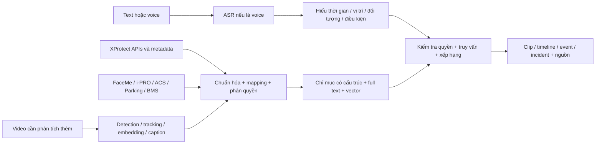

# Đề xuất chuẩn bị model và công cụ tìm kiếm

**Thiết kế hiện hành:** [ARCHITECTURE-V2.md](ARCHITECTURE-V2.md), ngày 16-09-2026, thay thế đề xuất sơ bộ dưới đây về kiến trúc/chức năng. Phần dưới giữ làm tham khảo nghiên cứu ban đầu; triển khai mới dùng V2 và ADR-0002.

**Cập nhật 15-09-2026:** xem [phân tích Event Server và kiến trúc plugin](EVENT-SERVER-SEARCH-ARCHITECTURE.md) dựa trên bản ghi thực: 113 alarm, 74 snapshot, 333 system event và 2 metadata device được bật. Tài liệu mới bổ sung cơ chế thu nhận, đồng bộ, model và UI; nội dung dưới đây là nền tảng thiết kế ban đầu.

Trạng thái: thiết kế sơ bộ để thảo luận, chưa chọn stack/model và chưa triển khai connector. Nguồn và giới hạn xác minh xem [README](README.md) và [CATALOG](CATALOG.md).

## Hai mục tiêu dữ liệu

1. **Tìm tài liệu kỹ thuật:** chỉ mục manual/API/plugin với bộ lọc vendor, product, release, ngôn ngữ và nguồn. Kết quả phải dẫn đúng trang/section; không trộn hướng dẫn bản cũ vào câu trả lời cho bản mới mà không nêu rõ.
2. **Tìm đối tượng/sự kiện/incident:** chỉ mục metadata, event, alarm, hồ sơ và video. Tài liệu kỹ thuật chỉ giúp xây connector; bằng chứng trả lời phải đến từ dữ liệu vận hành.

## Mô hình miền đề xuất

| Thực thể | Trường cốt lõi | Ý nghĩa |
|---|---|---|
| Site / Zone / Device | source_system, site_id, device_id, camera_id, name, aliases, timezone | Liên kết camera, cửa, làn xe, parking bay, BMS point; giữ ID gốc |
| Observation | observation_id, time_start/end, object_class, attributes, bbox, track_id, confidence | Một phát hiện; track ID phải có phạm vi camera/nguồn/thời gian |
| IdentityReference | provider, external_identity_id, match_score, reference_image_id | Kết quả do hệ nhận diện cung cấp; tách khỏi track và mô tả ngoại hình |
| Event | external_id, event_type, occurred_at, source_device, payload | Ví dụ access_denied, line_crossing, plate_read, fire_alarm |
| Alarm | external_id, event_refs, priority, state, assignee, updated_at | Workflow xử lý; không đồng nhất alarm với incident |
| Incident | external_id, title, description, category, status, event_refs, evidence_refs | Hồ sơ có ghi chú và nhiều bằng chứng; connector còn cần xác minh |
| ParkingSession | entry/exit_time, plate, lane, bay, ticket_ref | Nghiệp vụ bổ sung cho plate_read; không tự suy ra từ một ảnh |
| BMSObservation | point_id, property, value, unit, quality, observed_at | Giữ quality/unit và trạng thái; không gộp số đo thành alarm nếu chưa có rule |
| Evidence | camera_id, start/end, recording_ref, thumbnail_ref, source_refs | Mỗi kết quả phải mở được video/record liên quan và kiểm tra quyền |

Mọi bản ghi thêm `tenant_id`, `source_system`, `source_version`, `ingested_at`, `schema_version`, `raw_payload_ref`, `provenance`, `acl_scope`, `expires_at`. Timestamp chuẩn UTC kèm timezone gốc; không dùng thời gian nhận thay cho thời gian xảy ra mà không đánh dấu.

Các thuộc tính AI nên có provenance và confidence theo từng nguồn. `unknown` khác `false`: nguồn không có thuộc tính “áo đỏ” không có nghĩa người đó không mặc áo đỏ. Association người–xe–thẻ–sự kiện phải lưu căn cứ và độ tin cậy, không tự coi gần nhau về thời gian là cùng một người.

## Luồng xử lý đề xuất

- Dùng REST để lấy lịch sử event/alarm trong phạm vi API cho phép; subscribe realtime theo interface hỗ trợ. Có checkpoint, khử trùng lặp, reconnect, backfill và xử lý bản ghi đến muộn. Event không được lưu theo retention sẽ không tự xuất hiện khi query lại. Nguồn: [Events API](https://doc.developer.milestonesys.com/mipvmsapi/api/events-rest/v1/).
- Đọc recorded metadata qua SDK để index trước, thay vì quét toàn bộ recording mỗi lần người dùng hỏi. Nguồn khả thi: [Metadata Playback Viewer](https://doc.developer.milestonesys.com/mipsdk/samples/ComponentSamples/MetadataPlaybackViewer/README.html).
- Chỉ bổ sung CV/VLM cho những thuộc tính chưa có hoặc cần kiểm tra lại. Lấy metadata hiện có làm baseline để đo giá trị bổ sung.
- Dùng bộ lọc có cấu trúc cho thời gian/camera/biển số/trạng thái; semantic retrieval cho mô tả linh hoạt; xác minh clip sau retrieval. Không thay điều kiện chính xác bằng độ tương đồng vector.
- Tách backend tìm kiếm khỏi UI: có thể dùng web hoặc MIP Search Agent. Kết quả gồm camera, khoảng thời gian, thumbnail, lý do match và tham chiếu bằng chứng.
- Voice trước hết chuyển thành text rồi dùng cùng query pipeline. Cần xử lý lỗi nghe tên camera, biển số, từ phủ định và thời gian tương đối. Hiển thị transcript để sửa khi cần.
- Phân quyền ở bước truy vấn và lúc mở bằng chứng; index phụ cần đồng bộ hết hạn/xóa, không chỉ dựa vào retention của VMS.

## Thành phần AI nên thử nghiệm

| Thành phần | Mục đích | Cách chọn |
|---|---|---|
| ASR tiếng Việt/Anh | Voice → text | Đo WER và độ chính xác biển số, camera alias, thời gian trong môi trường ồn thực |
| Query parser | Text → điều kiện có cấu trúc | Đo accuracy theo từng slot, phủ định, điều kiện AND/OR và thứ tự sự kiện |
| Text-image/video embedding | Tìm theo mô tả ngoại hình/hoạt động | Đo recall@k trên dữ liệu camera ban ngày/ban đêm; kiểm tra tiếng Việt |
| Detector/tracker | Bổ sung object/track thiếu | Đo recall, tracking errors và tải GPU; giữ namespace track |
| VLM/reranker | Kiểm tra clip, tạo mô tả có bằng chứng | Đo false positive và mô tả không có căn cứ; không dùng mô tả để thay bằng chứng |
| Correlation engine | Ghép sự kiện ACS–parking–BMS–video | Quy tắc thời gian/vị trí và quan hệ có nguồn; phân biệt suy luận với record gốc |

[NVIDIA VSS](https://build.nvidia.com/nvidia/video-search-and-summarization/blueprintcard) là nguồn kiến trúc tham khảo cho video retrieval/VLM. [Ví dụ voice workflow](https://developer.nvidia.com/blog/build-an-agentic-video-workflow-with-video-search-and-summarization/) nối ASR/TTS với video agent. Đây không phải bằng chứng có connector XProtect hoặc chất lượng tiếng Việt đáp ứng yêu cầu. Chưa có dữ liệu benchmark/GPU nên chưa chốt model hoặc mua phần cứng.

## Bộ câu hỏi PoC

| Câu hỏi | Dữ liệu tối thiểu |
|---|---|
| Tìm người mặc áo đỏ ở cổng A từ 8 đến 9 giờ sáng hôm qua | Observation/attributes hoặc embedding + camera mapping + timezone |
| Xe biển 30A-123.45 đã vào cổng nào? | Plate event + lane/camera mapping + chuẩn hóa biển số |
| Các lần quẹt thẻ bị từ chối rồi cửa bị mở cưỡng bức trong vòng 30 giây | Hai event type ACS, cùng cửa, thứ tự và khoảng cách thời gian |
| Xe đỗ quá 2 giờ ở khu B | Parking session/occupancy history; không chỉ LPR |
| Mở video quanh báo cháy tầng 3 | BMS/fire event + point-to-zone-to-camera mapping |
| Incident chưa đóng liên quan mất đồ tuần trước | Incident fields + quyền + interface query được hỗ trợ |
| Người mang ba lô bỏ đồ rồi rời đi | Video sequence/action analysis; không chỉ ảnh đơn |
| Không thấy kết quả vì không có sự kiện hay camera thiếu dữ liệu? | Coverage/health/retention status của từng nguồn |

## Thứ tự PoC và điều kiện nghiệm thu

1. **Inventory và capability matrix:** xác định field thực nhận, retention, quyền và historical access của từng connector. Chọn mẫu dữ liệu có ground truth.
2. **Baseline có cấu trúc:** camera/time, event/alarm, plate; mỗi kết quả mở đúng clip. Kiểm tra timezone, camera mapping và dữ liệu trùng.
3. **Semantic object search:** thêm metadata attributes hoặc embedding; đo recall@k/precision@k, latency p50/p95, tải ingest và độ trễ index.
4. **Correlation và incident:** ghép timeline, không tự gọi một chuỗi event là hồ sơ Incident Manager. Nếu chưa có API được hỗ trợ, ghi nhận connector chưa hoàn tất.
5. **Voice:** thử tiếng Việt ba miền, tiếng ồn, tên riêng, biển số và câu có phủ định; so sánh kết quả với cùng truy vấn gõ tay.
6. **Kiểm tra vận hành:** mất kết nối, token hết hạn, thiếu metadata, hết retention, đổi quyền, đổi tên camera, daylight-saving ở site khác và sự kiện đến muộn.

Ngưỡng chất lượng/độ trễ cần thống nhất theo use case; chưa tự đặt số cam kết. Chưa cần huấn luyện từ đầu: dùng baseline có sẵn, đo lỗi thực rồi mới quyết định fine-tune embedding, ASR hoặc query parser.
